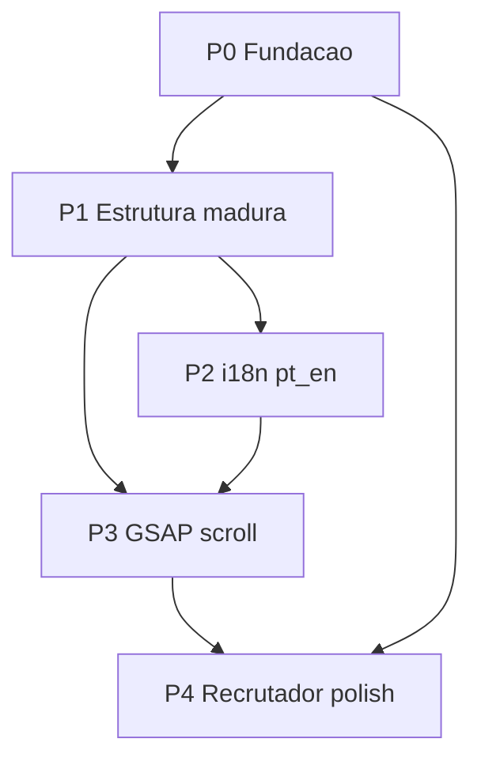

# Roadmap — Portfólio criativo para recrutadores

Documento de priorização do redesign do portfólio Angular (`meu-portifolio`).  
Ordem: **mais necessário → menos necessário** (P0 → P4).

Guia operacional detalhado: [`GUIA-EXECUCAO.md`](./GUIA-EXECUCAO.md).

---

## Visão do produto

Transformar o site em um portfólio **criativo, maduro e bilíngue (pt/en)** que impressione recrutadores:

- Estrutura de pastas alinhada a boas práticas Angular (standalone)
- Conteúdo tipado e fácil de manter
- i18n runtime com toggle no nav
- Motion com **GSAP + ScrollTrigger**, baseado nas demos oficiais:
  - [Footer bounce](https://demos.gsap.com/demo/footer-bounce/) → footer com cores do projeto
  - [Pinned panels with overscroll](https://demos.gsap.com/demo/pinned-panels-with-overscroll/) → layout de seções `width: 100vw`
  - [Lateral pin indicator](https://demos.gsap.com/demo/lateral-pin-indicator/) → seção de projetos
- Fundação sólida (assets, testes, deploy, a11y, SEO)

---

## Decisões técnicas travadas

| Tema | Decisão |
|------|----------|
| i18n | Runtime via `LanguageService` + JSON `pt`/`en` em `src/assets/i18n/` (sem builds separados Angular i18n) |
| Motion | Pacote `gsap` + plugin `ScrollTrigger`; registro central; cleanup com `gsap.context()` |
| A11y motion | `gsap.matchMedia()` + `prefers-reduced-motion` desliga pin/scrub pesado |
| Cores do projeto | Accent `#4f46e5`, texto/slate `#0f172a`, fundo `#f8fafc`, painéis escuros `#0f172a` / `#1e293b` |
| Contato | Reativar só após alinhar componente com Netlify Function (`/.netlify/functions/contact` + campo `mensagem`) |

---

## Estrutura-alvo de pastas

Evolução do padrão atual (`pages/` + `components/`), sem reinventar o app:

```text
src/app/
  core/
    i18n/                 # LanguageService, tokens, tipos
    gsap/                 # register + factories ScrollTrigger
  data/                   # projects, experience, skills tipados
  models/                 # interfaces
  components/             # UI existente (adaptada)
  pages/home/             # orquestra seções + animações de página
src/assets/
  i18n/                   # pt.json, en.json
  images/                 # profile, og-image
  cv/                     # Resume.pdf
  icon/                   # favicon
docs/
  ROADMAP.md
  GUIA-EXECUCAO.md
```

---

## Dependências entre fases



- **P3** depende de **P1** (dados tipados / DOM estável) e de **P2** (copy pt/en nas seções animadas).
- **P4** contato/SEO pode começar em paralelo após P0, mas o “pacote recrutador” fecha depois do motion.

---

## P0 — Fundação (bloqueante)

**Objetivo:** site buildável, assets reais, testes que sobem, deploy Cloudflare correto, tokens de design.

| Item | Por quê |
|------|---------|
| Restaurar `src/assets` (`images/profile.png`, `cv/Resume.pdf`, `icon/favicon.png`) | Hero, CV e SEO quebram sem isso |
| Tokens CSS em `src/theme/variables.scss` + uso em `global.scss` | Base para footer bounce e tema consistente |
| Corrigir specs: `HomePage` / `Nav` (`provideRouter`), `Contato` (`provideHttpClient`) | CI/local testável |
| `wrangler.jsonc` → `assets.directory: "www"` | Worker deve servir o build, não o source |
| README técnico alinhado (Angular 19 / Node 22) | Credibilidade para quem abre o repo |

**Pronto quando:** `npm start` e `ng build` ok; imagem/CV/favicon carregam; `ng test` headless não quebra por providers óbvios; preview Worker aponta para `www`.

---

## P1 — Estrutura madura

**Objetivo:** código organizável e “nível mid/senior” no review de recrutador.

| Item | Por quê |
|------|---------|
| Criar `core/`, `data/`, `models/` | Separação clara de responsabilidades |
| Projetos/experiência/skills em arrays tipados | Manutenção e i18n mais fáceis |
| Âncora `#educacao` + link na nav | Navegação por fragmento completa |
| Narrativa sem Ionic “fantasma” (UI é Angular puro) | README/código honestos; Capacitor só se for uso real |

**Pronto quando:** seções leem de `data/`; tipos em `models/`; educação navegável; pasta `core/` pronta para i18n/GSAP.

---

## P2 — i18n pt / en

**Objetivo:** portfólio bilíngue com UX simples para recrutadores internacionais.

| Item | Por quê |
|------|---------|
| `LanguageService` + `pt.json` / `en.json` | Toggle sem rebuild |
| Toggle no `nav` + persistência `localStorage` | Preferência do visitante |
| Meta `title` / `description` por idioma | SEO e compartilhamento |
| Traduzir hero, sobre, skills, experiência, projetos, educação, footer | Cobertura completa da home |

**Pronto quando:** PT↔EN troca copy e meta sem reload quebrado; idioma persiste; nenhuma string crítica hardcoded fora dos JSON (exceto nomes próprios / URLs).

---

## P3 — GSAP scroll criativo (core da impressão)

**Objetivo:** primeira experiência memorável, ainda performática e acessível.

| Item | Demo / referência | Onde |
|------|-------------------|------|
| Instalar `gsap`, registrar ScrollTrigger em `core/gsap` | Docs GSAP | `src/app/core/gsap/` |
| **Pinned panels with overscroll** — painéis full-bleed `width: 100vw` | [demo](https://demos.gsap.com/demo/pinned-panels-with-overscroll/) | Shell / seções da `home` |
| **Lateral pin indicator** — indicador lateral sincronizado ao pin | [demo](https://demos.gsap.com/demo/lateral-pin-indicator/) | `projetos` |
| **Footer bounce** — reveal elástico no fim do scroll, cores do projeto | [demo](https://demos.gsap.com/demo/footer-bounce/) | `footer` |
| Motion leve no hero (entrada) | GSAP core | `home` header |
| `matchMedia` + reduced motion + mobile sem pin agressivo | A11y / perf | todos os factories |

**Pronto quando:** desktop mostra os 3 efeitos com scrub/pin estáveis; mobile degrada com elegância; `ctx.revert()` no destroy; sem jank óbvio no scroll.

---

## P4 — Recrutador / polish

**Objetivo:** fechar confiança (contato, SEO, a11y, tema).

| Item | Por quê |
|------|---------|
| Reativar `app-contato` alinhado a `netlify/functions/contact.js` (JSON, `mensagem`, rota da function) | Canal real de lead |
| JSON-LD `Person` / `ProfilePage` | Rich results / profissionalismo |
| `og:image` dedicada (não só profile) | Preview social |
| A11y: remover `user-scalable=no`; `rel="noopener noreferrer"`; `aria-hidden` em decorativos; `aria-controls` no menu | Inclusão e checklist de recrutador |
| Dark mode real com tokens **ou** remover promessa `color-scheme: light dark` | Honestidade de design |
| Atualizar `sitemap.xml` `lastmod` | Higiene SEO |

**Pronto quando:** formulário envia de ponta a ponta em Netlify; SEO social ok; Lighthouse a11y sem regressões graves; tema coerente.

---

## Definição de “pronto para impressionar recrutador”

Checklist final (todas as fases):

1. Home carrega com identidade visual clara (nome como sinal hero) e copy pt/en.
2. Scroll desktop conta uma história: painéis pinned → projetos com indicador lateral → footer bounce na paleta do projeto.
3. Código organizado (`core` / `data` / `models`), tipado, testável.
4. Contato funciona ou CTAs (WhatsApp / LinkedIn / CV) estão impecáveis.
5. README e `docs/` explicam stack e como evoluir.

---

## Ordem sugerida de PRs

1. `P0` fundação  
2. `P1` estrutura + dados tipados  
3. `P2` i18n  
4. `P3` GSAP (pode ser 1 PR grande ou 3 PRs: panels / projetos / footer)  
5. `P4` polish recrutador  

Execução passo a passo: [`GUIA-EXECUCAO.md`](./GUIA-EXECUCAO.md).
